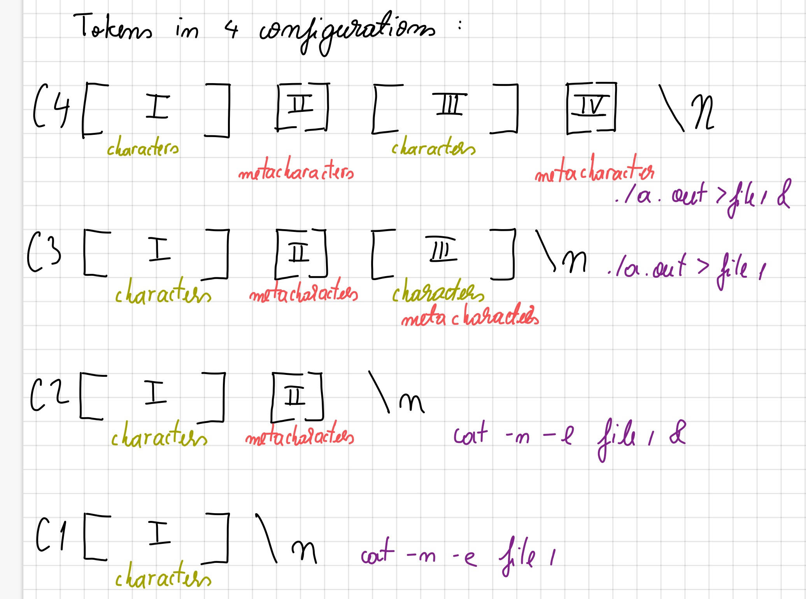

# OS - Assignment 2
## Authors: Mihai Popescu & Andrei Scurtu
## Exercise 1 - Writing a shell

### Problem description
The scope of the assignment was to build a pseudo-linux shell which supports the following:
- Start a program which can be found in the user's search ($PATH)
- I/O redirection
- Background processes
- Pipes
- String parsing

#### Set of special characters: {<, >, |, &, "}

### Start a program
The input line is parsed such that a command is tokenized into its arguments. In order to simulate a shell environment, the shell must be able to receive multiple inputs one after another, and as such the command is executed by a children of the shell. This is done by envoking the ```fork()``` function followed by ```execvp()```. 

### I/O redirection
**Redirection only happens between 1 output file and 1 input file.**
Redirection is handled differently in this assignment than the way it is implemented in Linux.
There are **at most** two redirection files: an input file and an output file. They lie anywhere in the input_line given by the user. The input redirection should be connected to the first command of the input_line, whilst the output redirection should be connected to the last command of the input_line.
If a redirection of the form occurs:
```bash
a.out | b.out | c.out < in
```
the input of a.out is ```in```.
If a redirection of the form occurs:
```bash
a.out | b.out < in | c.out > out
```
the input of ```a.out``` will be ```in``` and the final output will
be in ```out```. 
The logic is as follows:
1. The input of ```a.out``` will be ```in```.
2. ```a.out``` executes.
3. The output of ```a.out``` will be given to ```b.out``` as input.
4. ```b.out``` executes.
5. The output of ```b.out``` is given to ```c.out``` as input.
6. ```c.out``` executes.
7. The output of ```c.out``` will be written in the ```out``` file.

### Background processes
Background processes are simply regular processes that the shell does not wait for them to exit.
They were supported at one point during the shell by not waiting for the process to exit, however this proved
to cause orphan processes. One implementation that might deal with defunct processes is to store the pid of each process in the parent through an array. Knowing how many processes the parent has created, it would know for how many processes it should wait for. Unfortunately, we have not implemented this in the final version of the shell.

### Pipes
Pipes are implemented using file descriptors.

### String parsing
The shell interprets quotes "" as one meaningful chunk. As such, for inputs such as
```bash
grep "test < a" test
```
the shell would transform it into three tokens: {grep, test < a, test}. After communication with the T.A.s it seemed that only the outermost quotes should be used in order to group tokens and that test cases in which an odd number of quotes would be presented would not be used. The shell, for as much as we know, implements the parsing of strings correspondingly even though it does not passes Themis in this scenario.

### Shell construction
The shell has three phases.
1. The shell waits for an input_line from the user.
2. The shell checks if the input_line has a valid syntax with the grammar defined in the assignment.
3. The shell executes the input_line.

#### Input phase
The shell implements a dynamically allocated buffer in which it stores the input received from the user.

#### Validation of the input_line
The shell must check for the following scenarios in order for the input_line to pass to the execution phase:
- The input_line cannot end with a 'special character' apart from &.
- After every redirection arrow, at least one alpha numerical character or dot must appear to designate the corresponding file.
- A command must exist in order for it to be fired.
- A file may not be used for redirecting both the input and the output.

After every check has passed, the shell checks for I/O redirection files and saves the file names of them, if they are present in the input_line in order to set up file descriptors in the execution phase.
Then, the parser tokenizes the input_line into commands in two stages: first, the command is split separately by the pipe symbol ```|```. Afterwards, each resulting command is stored into an array of separated commands from which each command will fire.
#### Execution phase
After a command is ready for execution the shell checks if it is an empty command: if it is then it returns 1 and waits for the next command. Otherwise, it fires the command.

### Evaluation of performance
The program is able to pass test cases: {1, 4, 5, 6, 8, 10, 12}.
- Test case 9 passes when pipes are not implemented, indicating that there is some improper validation of a command when pipes are present.
- We were unable to find test cases for quotation symbols that the program did not dealt with the way it was expected of us.
- I/O redirection combined seems to work regardless of where one chooses to put the redirection symbols in the command line.
- Error checking is done in the validation phase and implements the types of errors described in the assignment.
- Overall, the program is able to simulate most of the functionality required in the assignment.

### Design choices
Functionality has been added and in order for commands including quotes to be parsed appropriately.
As an example, consider the command:
```bash
echo "some string <> with 'special' characters"
```
The command above will be tokenized into two tokens: ```echo``` and ```some string <> with 'special' characters``` It will print on the screen ```some string <> with 'special' characters```.
The trick is to take everything between the quotes as one argument of the command.
Example: <br/>
```bash
git commit -m "this is a message"
```
This command is supported by the shell. The git command will require the quotes to remain in the execution parameters of the command in order for git to parse the contents within the quotes as the body of the message.
```bash
cat "some file that's on the computer"
```
In this scenario, bash uses the quotes to logically group and evaluate the values of each variable between the quotes. Functionality-wise, it transforms the command into
```bash
cat some\ file\ that's\ on\ the\ computer
```
This is also supported by the shell as it takes as parameters to the command (```args[0] = cat, args[1] = some file that's on the computer```. Whatever ```cat``` chooses to do with the command (transform it into ```cat some\ file\ that's\ on\ the\ computer```) is up to it.
Lastly, if there are quotes within quotes, the program takes everything that is in-between the outer-most quotes as one token. So:
```bash
cat < "some file with "inner" quotes" -n
```
will be tokenized into {cat, <, some file with "inner" quotes, -n}.
This is different than the Linux way of doing it, which would be {cat, <, some file with , inner,  quotes, -n}, however after communication with the T.A.s we've learned that the former is required. Both versions have been implemented and both fail the third test case, and so we think that we might have missed an implementation bug or completely misunderstood the tokenization methodology expected of us for string parsing.
- [X] Implement background processes. Background processes were possible within the shell by specifying the special character ```&```. They have been removed since improper handling of the background processes resulted in orphan processes. 
```bash
xeyes &
```
was a valid command and it would start the process in background
```bash
xeyes&
```
would have also started a background process.
### Extensions
As far as extensions go we have implemented the following.
- [X] Retrieve history of commands using up-arrow key (implemented using GNU - readline library).
- [x] Builtin functions: cd/help/exit.
- [x] Auto-complete path names with tab (implemented using GNU - readline library.
- [X] Shell '>' prompt when awaiting an input. This is handy to have to observe background processes as the '>' is consistently after the output of the foreground process, whilst this is not the case for background processes.

### Development process
Seeing the scope of the assignment, we've started working on it fairly soon. Until the grammar was uploaded to nestor, we came up with our own way of interpreting commands in Linux:

It was based on four configurations that a command can be in. The program would check from C4 until C1 in order to assess in which configuration the input is. If it failed to match the input with any of the four configurations, it meant that the command was invalid.

This approach was quickly revamped as the grammar of the shell was made available (the old version can be found on [github](https://github.com/uberVelocity/os-2)).

We found that separating concerns in small functions made the program more modular. This is why we have two separate blocks used for launching a command. One block deals with simple commands without pipes, the other block implements the pipe handling:
```C
// Used for executing 
int launch(char **, char *, char *, int, int, int *, int);
```

### Conclusion
Overall, background processes and disposing of orphans are two features which are not yet supported by our shell. We think that one factor that influenced the development process of the shell is how we interpreted the grammar and the possible inputs that the shell can receive. In most cases we would debug the shell using Bash which, at least in the case of quotes and redirection, handles commands differently. As such, we had arrived at an implementation of a shell that was immitating Bash more-so than anything. After going to the lab on Thursday and clarifying the program's behaviour, major design changes had to be made and unfortunately we couldn't manage to implement every one. The trickiest part of the assignment, in our view, is handling the tokenization and interpreting the input line. We considered using Bison in order to parse the input_line, however none of us had any experience with it and decided against it. 

### Remaining Extensions:
- tab twice to show possibilities
- provide [emacs shortcuts](https://en.wikipedia.org/wiki/GNU_Readline)
- change environmental variables using export (can be used to implement [colors](https://www.cyberciti.biz/faq/bash-shell-change-the-color-of-my-shell-prompt-under-linux-or-unix/))
